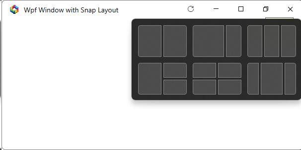

### Custom Window Titlebar with Snap Layout

This project provides a custom Wpf implementation of a window titlebar with snap layout that is available in Windows 11. 
It is based on the [ControlzEx](https://github.com/ControlzEx/ControlzEx) library, which provides a robust Window control supporting the Snap Layout feature.

